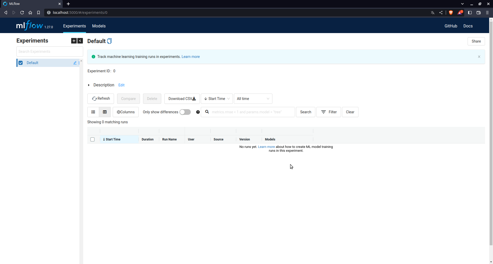
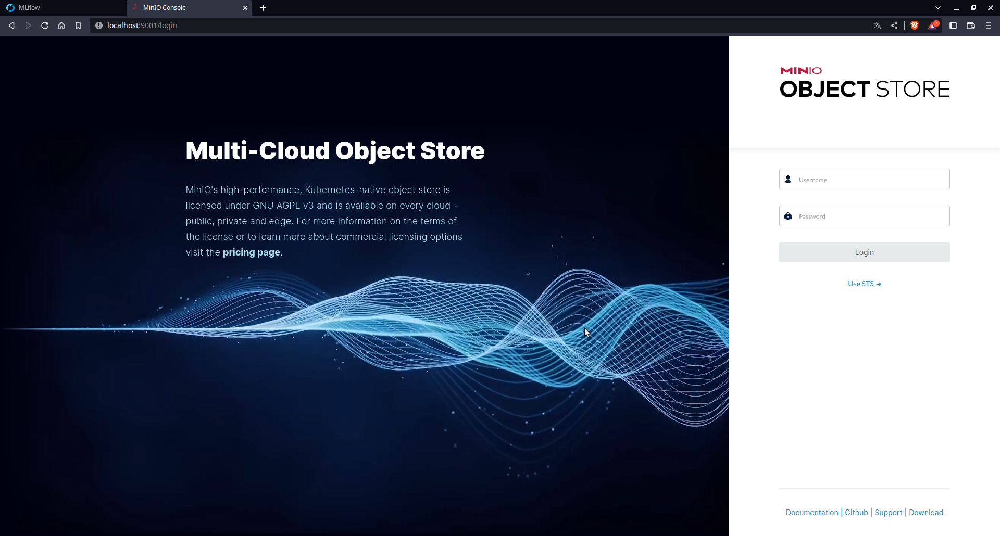
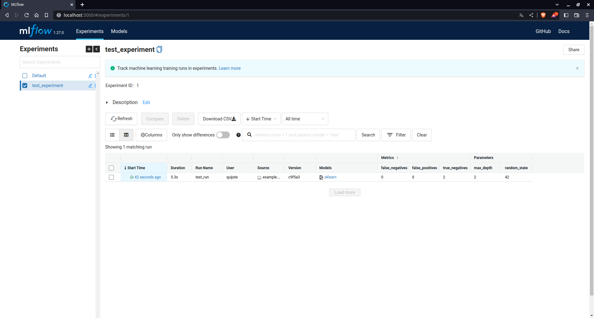
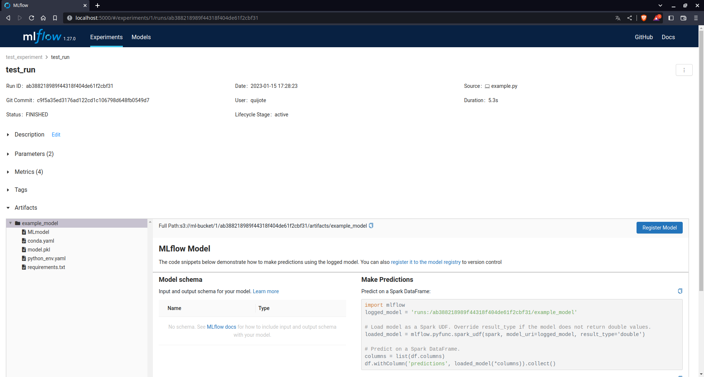

# Showcase: MLflow

## Voraussetzungen
1. docker und docker-compose
2. python 3.8
3. virtualenv

## Setup
### Docker-Image "mlflow-base" kompilieren
In einem Terminal in den mlflow-showcase-Ordner navigieren und folgenden Befehl ausführen:
```sh
docker build -t mlflow-base .
```

### Pfade in docker-compose-Datei anpassen
Damit die Services korrekt über docker-compose gestartet werden können,
müssen die in der ```docker-compose.yaml```-Datei enthaltenen Dateipfade zu den Volume-Mounts angepasst werden.

### Starten der Services
Wurden die Pfade angepasst, können die Services über
```sh
docker-compose up
```
gestartet werden.
Die MLflow-Oberfläche ist dann unter [http://localhost:5000](https://localhost:5000) erreichbar.



### Minio-(s3)-Bucket anlegen
Unter [http://localhost:9000](http://localhost:9000) ist außerdem die Minio-Oberfläche erreichbar.  



Minio dient in diesem Beispiel als s3-Schnittstelle.
Default-Logindaten sind `minioadmin:minioadmin`.  

__Hier muss entsprechend der docker-compose-Datei ein Bucket namens "ml-bucket" angelegt werden.__


### Python-Umgebung einrichten
Mit

```sh
virtualenv venv
source activate venv/bin/activate
```

kann eine neue virtuelle Umgebung erstellt werden und aktiviert werden.  
Anschließend können die benötigten Bibliotheken über

```sh
pip install -r requirements.txt
```

in dieser Umgebung installiert werden.


## Verwendung
[MLflow-Dokumentation](https://mlflow.org/docs/latest/index.html)
`python example.py` führt den Beispiel-Code aus.
Nach Ausführung wurde ein neues Experiment auf der MLflow-Oberfläche angelegt,
in dem der eben gestartete run dokumentiert ist.



Der gestartete run mit allen dokumentierten Parametern, Metriken und Artefakten (dem trainierten Modell + Metadaten) ist wie folgt geloggt:
